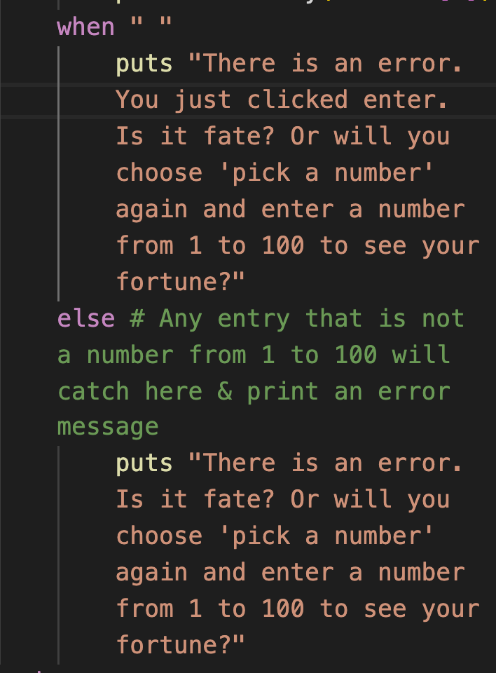
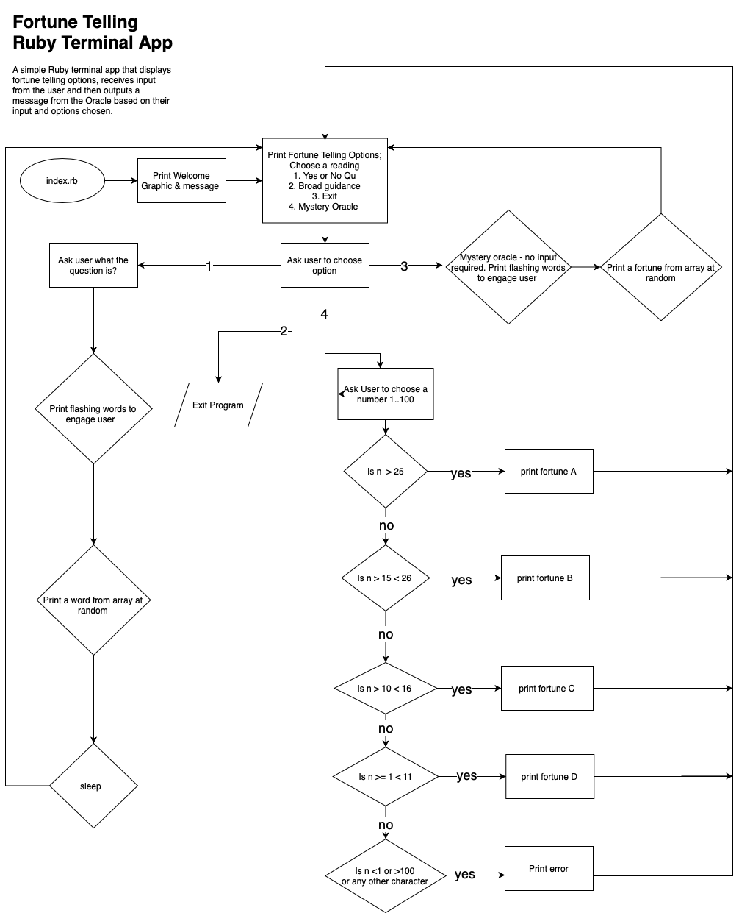
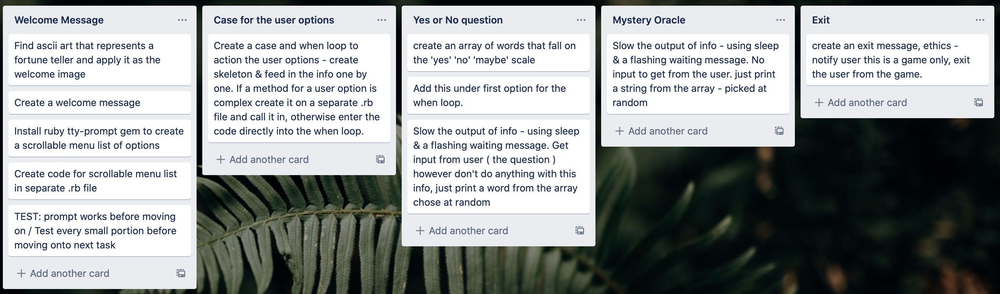

# TerminalApp
* A fortune telling game that is run through Ruby Terminal. 

* Link to Github Repository https://github.com/jmartinmcg/TerminalApp.git

# Software Development Plan

## Statement of purpose and scope 
- A fortune telling game built in Ruby that is run from the terminal. 
- It is built to include variables and variable scope, loops, error handling, and Ruby Gems. 

#### Identity problem/s the App will solve 

1.	Fortune telling for life guidance 
Many people look for guidance to lifes’ problems through fortune telling. Whether they accept the answers or fortunes they receive, or they use it as a measure to test how they feel about a topic; They do this by receiving the fortune or answer and reflecting on their reaction to that information to test how they feel about the area of life they are unsure about. This App provides a free fortune telling service where users can ask a specific yes or no question or ask for a broad message. 
####

2.	Fortune telling for entertainment purposes or Group Game users 
Truth or dare and similar group games are really popular, particularly among teenagers and young adults. This game provides a fun way to determine if a member of the group should complete the dare or answer the truth – by using the Oracle’s ‘yes or no question’ function to decide. Additionally, a lot of people use fortune telling for entertainment purposes 

#### Target Audience 
The target audience is split into those people seriously using the information received as guidance and those that use it as a game alone or with friends. Those that use this as a game are easier to determine as a demographic – they will mainly be teenagers or young adults. However, people seeking fortune telling for life guidance or entertainment purposes are a very broad demographic spanning all ages and spending in the US alone $2.2 billion a year (IBIS, 2019). 


#### User interaction

###### Game users
* Those that use it as a game might do so by coming up with group questions and using the game to determine the answer. For example, the group might do dares and say “Should Fiona cut a fringe in her hair” and then using the App's 'yes or no question' function to determine whether the dare should be done or left.   

###### Life guidance users
* Users seeking life guidance can use the App in different ways. Users may have a specific question in mind that they want to seek guidance on, in which case they can use the 'yes or no question function' and type in a 'yes or no' question for the oracle. The oracle will 'think' about the question which is displayed by the flashing message 'the oracle is thinking' and then it will respond with an answer from the list of answers = ["yes", "no", "maybe", "can't be sure right now", "time will tell"]. Users also have the option to not share their question but still seek an answer by pressing 'enter' twice when prompted for their question. 
* Users can also choose the option to ask for a mystery oracle reading. This option will present the user with a message not based on a question they have asked for.  


## User - Features List - MVP 
-As a user, I want to be able to ask a specific question and receive an answer on the scale of 'yes' to 'no'
- As a user, I want to be able to not have a specific question and just ask the oracle for a quick fortune without providing any information about myself
- As a user, I want to be able to be able to ask for psychic guidance about a broad topic in my life 

## Features List - nice to haves 
- As a user, I want to see colourful text and a mystical aesthetic to connect to the App

## User experience details 
- The App gives clear instructions to the user 
- The App feels like it has a oracle thinking through the questions 
- The App handles errors gracefully, and gives error messages that interpret the error as divinely created

## List of Features included in the application

1. ##### 'Pick a number' fortune telling 
This feature allows users to type a number from 1 to 100 and the program will display a fortune based on the user input. If the user input is not a number from 1 to 100 an error message will display. I use a separate .rb file for the method to run this feature. I then call on it in the main .rb file (index.rb) in the prompt ruby gem under the option for 'pick a number'. I use a ```case``` in the method and a ```when``` loop. The error handling is done with two parts as seen in the code below. A ```when " "``` displays an error message for if the user makes no entry and just hits enter. There is also an error message for any other entry that is not 1..100. I created the ```when " "``` because in my testing ```else```clause did not pick up when I typed in an empty strings and pressed enter. 

I used this instead of ```rescue``` error handling because i liked the layout of this more. It aesthetically worked with my App. I customised the error message to give it a mystical theme. 

2. ##### Prompt gem for scroll through list of user options 
This feature displays the App options  in a scroll through menu in which the user can use the up or down arrows to scroll through and the Enter key to select an option. This is aesthetically pleasing, user friendly, and also minimises errors by reducing user input which reduces incorrect user entries. 

This feature creates a method that calls in the Ruby TTY-prompt gem. Then I ran a case to run the user choices. Inside the ```def``` method there is an input variable and this is a local variable which is unaccessible outside the method. I.e it cannot be called on outside the method, unless it was changed to a global variable.

I had a development issue with the loop in that once one option had been created it would re-display the options but when you chose an option in the prompt it would exit you from the game. I created a ```while``` loop for the prompt options that resolved this issue for me, as displayed below.  


3. ##### Waiting time after user input

The App's default is to display the fortune almost instantly once the user chooses an option. It is more engaging for the user if they have to wait a little bit, an amount of time that could feel similar to a human interaction. I created this by adding ```sleep``` and also creating a flashing display saying "the oracle is thinking". I created the flashing effect by displaying and then removing the text multiple times, as seen in the code snippet below. 


## Control flow diagram 


## Implementation plan 
I used Trello for my implementation plan. I broke it down into steps following the flowchart. A screen grab of some of the steps is below along with a link to my Trello project page.


https://trello.com/b/uovgQo4y/jackmartinterminalapp

## How to install and use 

##### Dependancies 
- Ruby 
- Computer 
###### Gems
- rspec
- colorize 
- TTY prompt 
- bundler 

To install and run 
- '$ gem install bundler'
- '$ bundle install'
- '$ ruby index.rb'


References 
###### Ascii Art sourced from https://ascii.co.uk/art/fortune

IBIS, December 2019, Psychic Services Industry in the US, IBIS World, viewed 14 December 2020, https://www.ibisworld.com/united-states/market-research-reports/psychic-services-industry/

###### Software Testing 
I was unable to understand how to use rspec. I watched all the videos and did looks of googling but could not understand how to make it work. I have left my examples of how i tried in the spec folder. 
